# goit-rdb-hw-04


***Технiчний опис завдань***

## **Тема 4: DML та DDL команди. Складні SQL вирази**

### Вам потрібно буде:

У цьому домашньому завданні ви матимете можливість застосувати отримані знання з мови SQL для **створення та роботи з базою даних**.

### Це завдання допоможе вам:

Завдання розкриє процес **визначення структури таблиць за допомогою DDL-команд**, наповнення їх тестовими даними **за допомогою DML-команд**.

Воно також сприятиме отриманню **навичок написання складних запитів з використанням декількох операторів JOIN** для об'єднання таблиць.

### Підготовка та завантаження домашнього завдання:

1. Створіть публічний репозиторій `goit-rdb-hw-04`
2. Виконайте завдання та відправте у свій репозиторій скриншоти створених таблиць, запитів і результатів, а також текст SQL коду та відповіді на запитання в текстовому файлі
3. Завантажте скриншоти і текстовий файл на свій комп’ютер та прикріпіть їх в LMS архівом. Назва архіву повинна бути у форматі `ДЗ4_ПІБ`
4. Прикріпіть посилання на репозиторій `goit-rdb-hw-04` та відправте на перевірку

> 💡 Будь ласка, пронумеровуйте скріншоти, щоб менторам було зрозуміло, до якого етапу ДЗ відноситься кожний з них. Наприклад, якщо файл відноситься до пункту 3, то назва файла має починатися так: `p3_`.

### Опис домашнього завдання:

1. Створіть базу даних для керування бібліотекою книг згідно зі структурою, наведеною нижче. Використовуйте DDL-команди для створення необхідних таблиць та їх зв'язків. **Структура БД:**
    a. Назва схеми — “LibraryManagement”
    b. Таблиця "authors":
      - `author_id` (INT, автоматично зростаючий PRIMARY KEY)
      - `author_name` (VARCHAR)

    c. Таблиця "genres":
      - `genre_id` (INT, автоматично зростаючий PRIMARY KEY)
      - `genre_name` (VARCHAR)

    d. Таблиця "books":
      - `book_id` (INT, автоматично зростаючий PRIMARY KEY)
      - `title` (VARCHAR)
      - `publication_year` (YEAR)
      - `author_id` (INT, FOREIGN KEY зв'язок з "Authors")
      - `genre_id` (INT, FOREIGN KEY зв'язок з "Genres")

    e. Таблиця "users":
      - `user_id` (INT, автоматично зростаючий PRIMARY KEY)
      - `username` (VARCHAR)
      - `email` (VARCHAR)

    f. Таблиця "borrowed_books":
      - `borrow_id` (INT, автоматично зростаючий PRIMARY KEY)
      - `book_id` (INT, FOREIGN KEY зв'язок з "Books")
      - `user_id` (INT, FOREIGN KEY зв'язок з "Users")
      - `borrow_date` (DATE)
      - `return_date` (DATE)
2. Заповніть таблиці простими видуманими тестовими даними. Достатньо одного-двох рядків у кожну таблицю
3. Перейдіть до бази даних, з якою працювали у *[темі 3](https://github.com/IRONKAGE/goit-rdb-hw-03)*. Напишіть запит за допомогою операторів `FROM` та `INNER JOIN`, що об’єднує всі таблиці даних, які ми завантажили з файлів: `order_details`, `orders`, `customers`, `products`, `categories`, `employees`, `shippers`, `suppliers`. Для цього ви маєте знайти спільні ключі.

>Перевірте правильність виконання запиту.

4. Виконайте запити, перелічені нижче.
    - Визначте, скільки рядків ви отримали (за допомогою оператора COUNT)
      >💡 Не забувайте робити скриншоти результатів і запитів
    - Змініть декілька операторів `INNER` на `LEFT` чи `RIGHT`. Визначте, що відбувається з кількістю рядків. Чому? Напишіть відповідь у текстовому файлі
    - На основі запита з пункта 3 виконайте наступне: оберіть тільки ті рядки, де `employee_id > 3` та `≤ 10`
    - Згрупуйте за іменем категорії, порахуйте кількість рядків у групі, середню кількість товару (кількість товару знаходиться в `order_details`.`quantity`)
    - Відфільтруйте рядки, де середня кількість товару більша за 21
    - Відсортуйте рядки за спаданням кількості рядків
    - Виведіть на екран (оберіть) чотири рядки з пропущеним першим рядком

### Критерії прийняття:

> **Критерії прийняття домашнього завдання є обов’язковою умовою оцінювання домашнього завдання ментором. Якщо якийсь з критеріїв не виконано, ДЗ відправляється ментором на доопрацювання без оцінювання.**
> Якщо вам “тільки уточнити”😉 або ви “застопорилися” на якомусь з етапів виконання — звертайтеся до ментора у Slack :)

1. Прикріплені посилання на репозиторій `goit-rdb-hw-04` та безпосередньо самі файли репозиторію архівом
2. Створено базу даних з необхідною структурою
3. Таблиці заповнено тестовими даними
4. SQL команди до кожного пункту чи підпункту виконуються і дають очікуваний результат (створюють таблиці чи роблять певні операції з даними)
5. Дано відповіді на запитання в 4-му пункті

---

## 🛡️ DevOpsML SQL Lab - Завдання 04 (goit-rdb-hw-04)

### 1. Як все запустити

Завдяки вбудованому оркестратору (`Makefile`), запуск і налаштування інфраструктури повністю автоматизовані.

#### 🚀 Швидкий запуск (В одну команду)

1. Клонуйте репозиторій.
2. Переконайтесь, що у вас встановлені **Docker** та **Make**.
3. Створіть файл `.env` з паролями (дивіться `.env.example`).
4. Виконайте команду:

   ```bash
   make start
   ```

- 🐳 Перевірить і самостійно запустить Docker (якщо він був вимкнений).
- 🧱 Підніме Backend-інфраструктуру (API ядро та Adminer).
- 📦 Ініціалізує ізольоване віртуальне середовище `.venv`.
- 🌐 Запустить Frontend-сервер.
- 🖥️ **Самостійно відкриє браузер** із готовою SQL IDE за адресою `http://127.0.0.1:3000`.

### 📦 Standalone-версія

Для збірки проекту в єдиний HTML-файл (включаючи JS, CSS та вшитий SQL-код):

```bash
make build
```

#### 🛠️ Додаткові команди (Управління ядром)

Ваш термінал тепер — це пульт управління всіма базами даних. Ось основні команди:

- `make help` — показати інтерактивне меню з усіма доступними командами.
- `make db-manage` — відкрити CLI-менеджер фабрики баз даних (дозволяє на льоту створювати/видаляти контейнери з PostgreSQL, MySQL, MSSQL чи Oracle).
- `make db-adminer` — автоматично відкрити резервну панель **Adminer** у браузері (`http://127.0.0.1:8080`).
- `make down` — безпечно зупинити всі контейнери Backend-у.
- `make clean` — **Hard Reset**: жорстко видаляє всі згенеровані бази даних, контейнери, мережу та `.venv`, повертаючи проект до абсолютно чистого стану.

---

### 2. Структура проекту, ER-діаграма та Flowchart

#### Структура проекту - Логічний (Business-Logic First)

```text
goit-rdb-hw-04/                 # 🌌 Універсальний простір стенду
│
├── backend/                    # 🐍 Backend Service (Python / FastAPI)
│   ├── main.py                 # REST API та SQL Execution Engine
│   ├── db_manager.py           # 🗄️ CLI-менеджер інфраструктури (Docker, Dump/Restore)
│   ├── Dockerfile              # 🫍 Конфігурація мікросервісу
│   └── requirements.txt        # 🧬 Залежності бекенду
│
├── frontend/                   # 🌐 Frontend App (Vanilla JS / Event-Driven)
│   ├── css/                    # 🎨 Tailwind конфіги та UI теми (Dracula/Alucard)
│   ├── dicts/                  # 🧠 Словники IntelliSense для різних СУБД
│   │   ├── mssql.json          # Словник для MS SQL Server
│   │   ├── mysql.json          # Словник для MySQL
│   │   ├── oracle.json         # Словник для Oracle DB
│   │   └── postgres.json       # Словник для PostgreSQL
│   ├── js/                     # ⚙️ Бізнес-логіка та Архітектура
│   │   ├── core.js             # 🚀 Точка входу (Entry Point) — ініціалізація та запуск системи
│   │   ├── config.js           # 🔧 Статична конфігурація (API_URL, PROJECT_NAME)
│   │   └── components/         # 🧩 Ізольовані UI-модулі
│   │       ├── editor/            # 📦 Підсистема Редактора (Ізольований домен)
│   │       │   ├── TabManager.js     # 🗂️ Логіка "Картотеки" (JSON State, кольори, створення/закриття табів)
│   │       │   └── ToolbarActions.js # 🛠️ Логіка панелі інструментів (Execute, Format, Import/Export)
│   │       ├── 1_WorkspaceHeader.js  # 🎛️ Панель управління, підключення та теми
│   │       ├── 2_QueryEditor.js      # 🎩 Фасад Редактора (Layout, ініціалізація CodeMirror та зв'язка модулів з папки editor/)
│   │       ├── 3_DataGrid.js         # 📊 Рендеринг таблиць та ETL-імпорт CSV
│   │       ├── 4_SchemaInspector.js  # 🕸️ Генерація ER-діаграм (Mermaid.js) та навігація по схемі
│   │       ├── 5_ConsoleLogger.js    # 💻 Вбудований термінал логів та помилок
│   │       ├── 6_SnippetEngine.js    # ✂️ Управління шаблонами коду та автозаповненням
│   │       └── 7_UIController.js     # 🚌 Event Bus (Шина подій) та Головний Оркестратор (Mediator)
│   ├── locales/                # 🌍 Мовні пакети (uk.js, en.js)
│   ├── sql/                    # 📜 SQL-скрипти (DDL/DML/DQL)
│   │   └── Step_*.sql          # 🏆 Ізольовані кроки SQL-запитів для поточного ДЗ
│   └── index.html              # Головний Entry Point
│
├── data/                       # 📊 Набір даних (ETL Sources)
│   └── *.csv                   # Сирі дані для імпорту в таблиці
│
├── img/                        # 🖼️ Медіа-ассети для оформлення ReadMe.md
│   └── *.png                   # Скриншоти результатів для здачі ДЗ в LMS
│
├── .venv/                      # 📦 Ізольоване середовище Python (Автогенерація)
├── databases.json              # 🗄️ Реєстр активних БД-контейнерів
├── docker-compose.yml          # 🐳 Мережева інфраструктура
├── Makefile                    # 🪄 Головний Оркестратор (make start, make db-add)
├── builder.py                  # 🛠️ CI/CD Бандлер (Збірка HTML версії)
├── hw_submission.html          # 📦 Фінальний артефакт (Генерується 'make build')
├── sql_query_***.sql           # 💾 Експортовані нашою IDE SQL-скрипти для MySQL
├── backup_mysql_2489_***.sql   # 📦 Повний SQL-дамп MySQL
├── .editorconfig               # ⚙️ Правила форматування коду для IDE
├── .gitignore                  # 🙈 Файли, які ігнорує Git
└── README.md                   # 📖 Технічна документація проекту
```

#### ER-Діаграма Датасету (Mermaid)

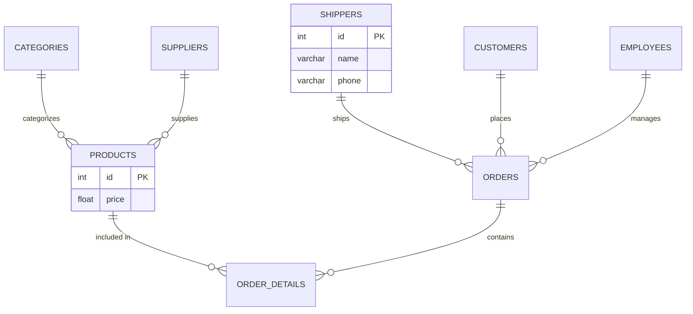

#### Архітектура виконання

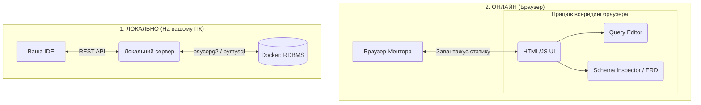

---

### 3. Висновки з усіма світлинами

У ході виконання завдання було закріплено навички роботи з DDL (створення структури БД `LibraryManagement`), DML (наповнення тестовими даними) та написання складних DQL запитів із використанням `JOIN`, агрегатних функцій і фільтрації. Всі запити були оптимізовані та перевірені у власній SQL IDE.

#### 📝 Архітектурна специфіка MySQL та контейнерна оркестрація

У ході виконання **Завдання 1 (DDL)** та проектування структури `LibraryManagement` було досліджено фундаментальну архітектурну відмінність СУБД MySQL та особливості її взаємодії з власним менеджером баз даних (Python-оркестратором).

> **Нюанс №1: Схема vs База Даних у MySQL**
> В академічному SQL поняття **База Даних (Database)** та **Схема (Schema)** чітко розділені: схема виступає логічним простором імен *всередині* бази. Проте **MySQL обробляє ці терміни як абсолютні синоніми**. Команда `CREATE SCHEMA LibraryManagement` під капотом фізично створює нову, повністю ізольовану БД.
>
> **Нюанс №2: Інфраструктура (Docker) vs SQL-контекст**
> Файл конфігурації інфраструктури (`databases.json`) зберігає лише "вхідну точку" (endpoint) до Docker-контейнера сервера із вказанням бази за замовчуванням (наприклад, `goit_rdb_hw04`). Нові створені схеми туди не записуються, оскільки вони є внутрішніми об'єктами СУБД, а не новими серверами.
>
> **Практична реалізація та налаштування доступу:**
> Щоб не змішувати таблиці бібліотеки з даними попередніх завдань у єдиній БД `goit_rdb_hw04`, архітектуру було налаштовано для підтримки множинних схем на одному сервері. Через консоль Docker-контейнера від імені `root` робочому користувачу `hw_admin` було делеговано глобальні права:
> `GRANT ALL PRIVILEGES ON *.* TO 'hw_admin'@'%';`

```bash
# 1 команда:
docker exec -it rdb_mysql_2489 mysql -u root -psuper_secure_root_password
# 2 команда:
CREATE USER 'hw_admin'@'%' IDENTIFIED BY 'super_secure_root_password';
GRANT ALL PRIVILEGES ON *.* TO 'hw_admin'@'%';
FLUSH PRIVILEGES;
```

> Це рішення дозволило системі (і самописній IDE) працювати як повноцінний клієнт: динамічно створювати нові бази (`CREATE SCHEMA LibraryManagement`) та безшовно перемикати контекст виконання запитів за допомогою `USE LibraryManagement;`. При цьому конфігурація з'єднання на рівні оркестратора залишається єдиною і стабільною.

#### 📝 Інженерний висновок: INNER vs LEFT та RIGHT JOIN

> **Що відбувається з кількістю рядків при заміні `INNER JOIN` на `LEFT` чи `RIGHT JOIN`?**
> Кількість рядків може збільшитися (або залишитися такою ж).
>
> **Чому:**
>
> - `INNER JOIN` відфільтровує та залишає ТІЛЬКИ ті рядки, де є збіг ключів в обох таблицях.
> - `LEFT JOIN` гарантовано повертає ВСІ рядки з "лівої" таблиці, навіть якщо немає збігів справа (заповнює їх `NULL`).
> - `RIGHT JOIN` працює дзеркально: гарантовано повертає ВСІ рядки з "правої" таблиці (наприклад, всі категорії або всіх працівників, навіть якщо вони не фігурують у конкретних замовленнях).
>
> **Чому 518 рядків для базових запитів — це нормально (ОК)?**
> У нашій базі підтримується строга цілісність даних (Referential Integrity). Немає жодної деталі замовлення (`order_details`), яка б не належала конкретному замовленню (`orders`), і навпаки. Тому проста заміна кількох `INNER` на `LEFT/RIGHT` у верхній частині запиту не створює нових рядків — база знаходить 100% відповідностей, і ми стабільно отримуємо 518 рядків.
>
> **ДОДАТКОВИЙ ТЕСТ (Демонстрація зміни кількості рядків):**
> Щоб кількість рядків дійсно змінилася (наприклад, щоб побачити клієнтів, які зареєструвалися, але ще не зробили замовлень), потрібно використовувати `RIGHT JOIN` до таблиці `customers`, а **всі наступні з'єднання перевести в `LEFT JOIN`**, щоб не "зрізати" отримані `NULL`-значення. В іншому випадку (якщо залишити `INNER JOIN` у кінці запиту) вони відкинуть ці "порожні" рядки, і ми знову отримаємо 518. Використовуючи правильну комбінацію `RIGHT` та `LEFT JOIN`, ми обходимо цю пастку та отримуємо **535 валідних рядків** (518 реальних замовлень + 17 порожніх клієнтів).

#### 🖼️ Світлини виконання та висновки

**Крок 1: Створення бази LibraryManagement (DDL)** *(Створення 5 пов'язаних таблиць: authors, genres, books, users, borrowed_books)*
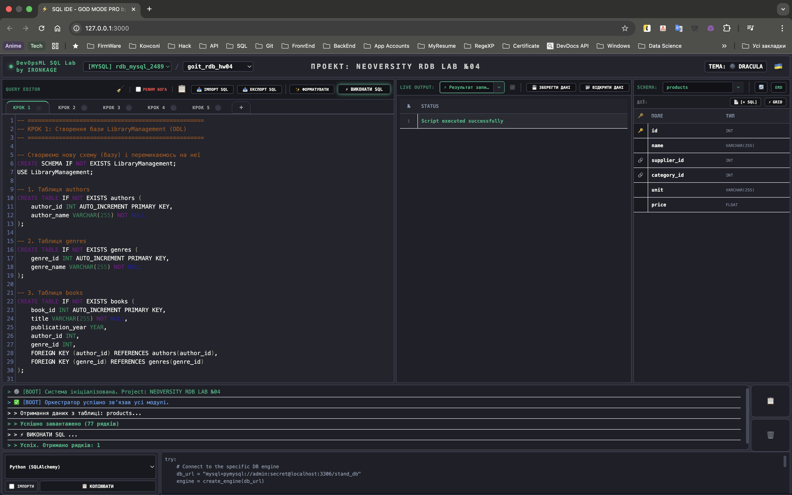

**Крок 2: Наповнення тестовими даними (DML)** *(Вставка даних у таблиці та перевірка цілісності)*
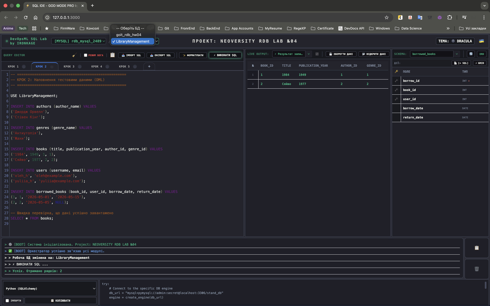

**Крок 3: Мега-об'єднання 8 таблиць (DQL)** *(Використання INNER JOIN для зведення всіх даних навчальної БД в єдину таблицю)*
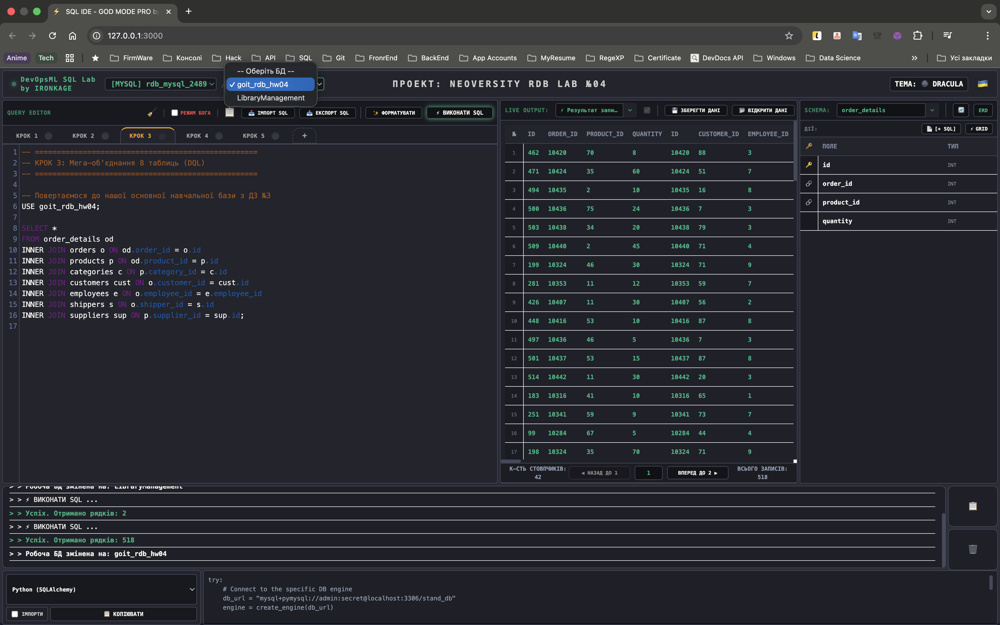

**Крок 4: Складна Аналітика** *(Фільтрація за employee_id, групування за категорією, підрахунок середнього quantity, сортування та лімітування)*
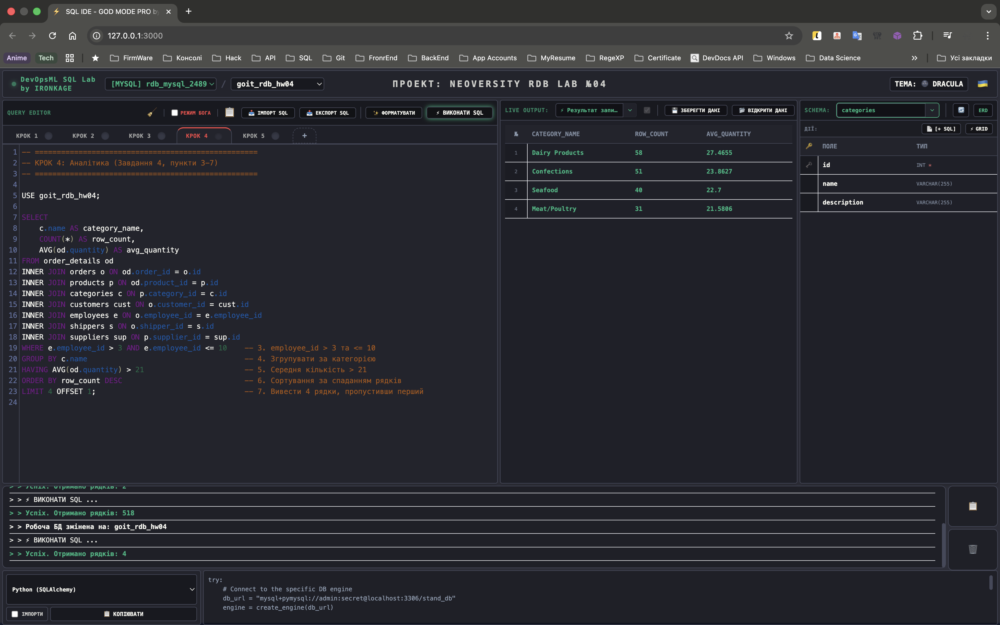

**Крок 5: Аналіз JOIN та COUNT** *(Комплексне порівняння кількості рядків при використанні різних типів об'єднання)*

- **5.1. INNER JOIN** *(Тільки 100% збіги - стабільний результат 518 рядків)*:
  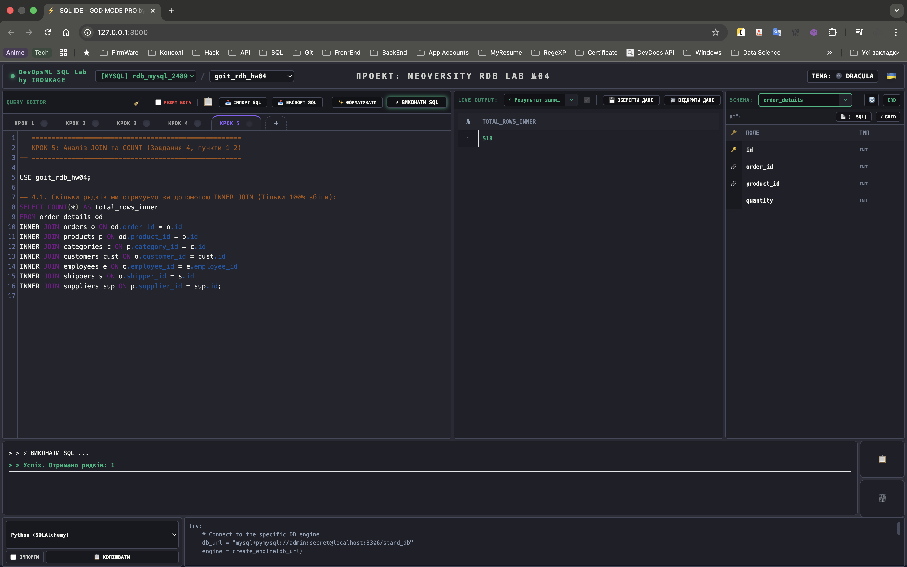

- **5.2. LEFT JOIN** *(Гарантоване виведення всіх записів з лівої/основної таблиці - результат 518 рядків через цілісність БД)*:
  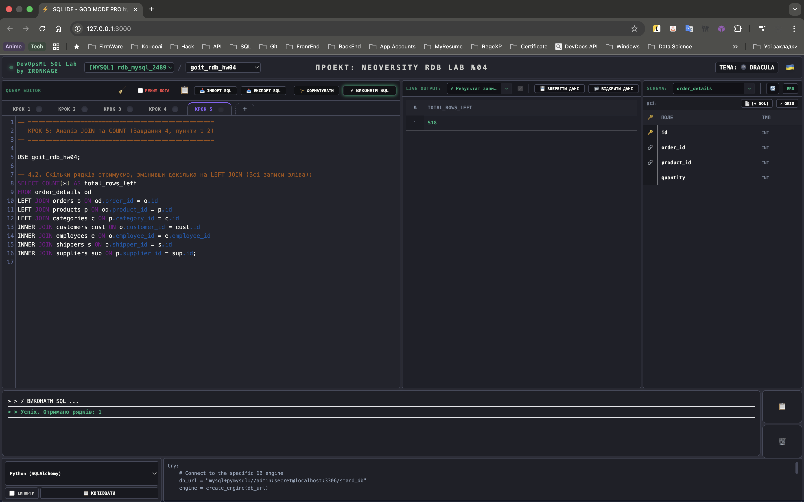

- **5.3. RIGHT JOIN** *(Гарантоване виведення всіх записів з правої таблиці - результат 518 рядків через "воронку" наступних INNER JOIN)*:
  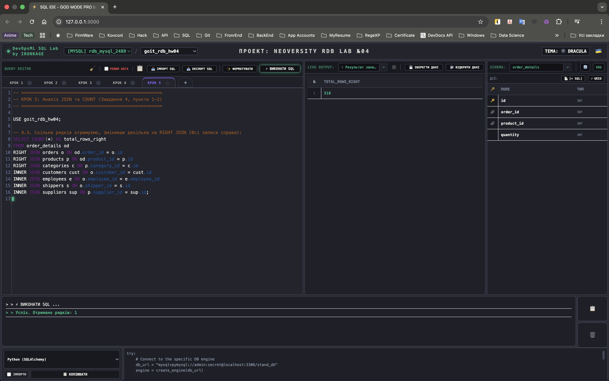

- **5.4. ДОДАТКОВИЙ ТЕСТ: RIGHT + LEFT JOIN** *(Демонстрація правильного збереження NULL-значень для клієнтів без замовлень - результат 535 рядків)*:
  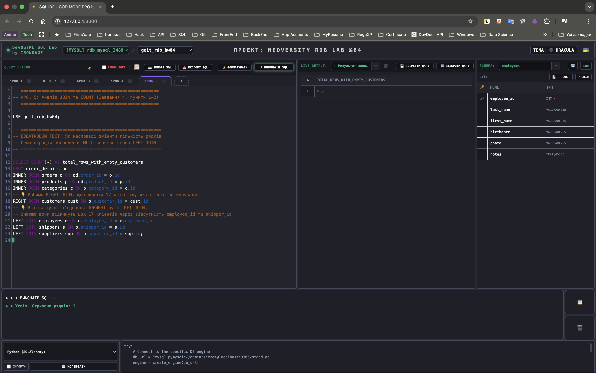

#### 📊 Фінальна ER-діаграма згенерована системою

*Таблиці в базі даних goit_rdb_hw04:*


*Таблиці в базі даних LibraryManagement:*
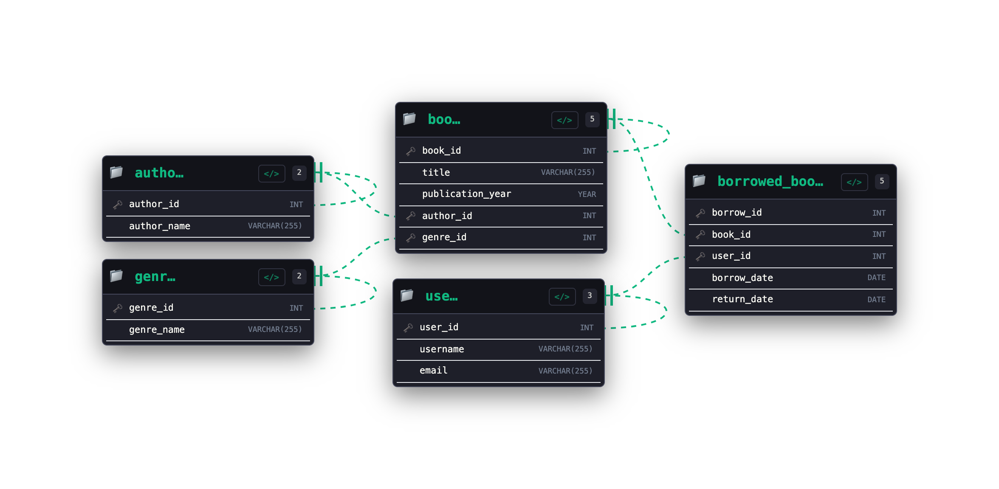

*Бази даних у СУБД MySQL (Інтерфейс моєї IDE):*
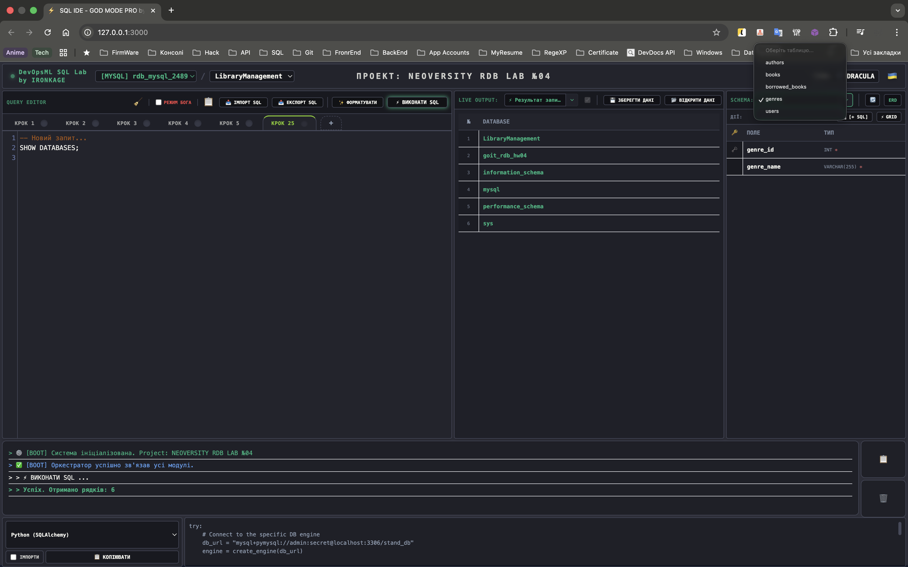

---

### 4. 🚀 Аудит екосистеми: DevOpsML SQL Lab

Наша IDE складається з 6 повністю незалежних, але глибоко інтегрованих модулів. Кожен модуль відповідає за свою зону і спілкується з іншими через глобальний Event Bus (подієву архітектуру). *Ще є багато чого, що у майбутньому покращиться...*

| Модуль | Стан | Опис реалізації |
| :--- | :--- | :--- |
| **Workspace & Core** | ✅ | Event Bus архітектура на базі Custom Events для синхронізації станів. |
| **Query Editor** | ✅ | CodeMirror 5 з AST-форматуванням та підтримкою діалектів СУБД. |
| **Data Grid & Import** | ✅ | Транзакційний батч-імпорт (5000 рядків/чанк) з Auto-Type Inference. |
| **Schema Inspector** | ✅ | Динамічна побудова DAG-сітки таблиць та Crow's Foot нотація. |
| **Console Logger** | ✅ | Потоковий висновок системних подій з підтримкою локалізації. |
| **Snippet Engine** | ✅ | Генерація Boilerplate коду для 13 мов (Python, Rust, Go та ін.). |
